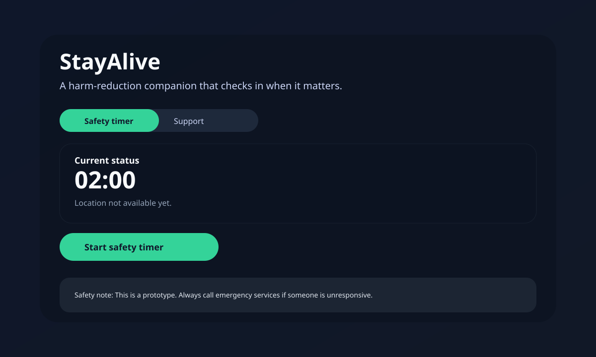

# 🛟 StayAlive

Harm-reduction boilerplate built with **Expo + Tailwind CSS (NativeWind)**. The
goal is to help people set a safety timer before use, check in, and share a
captured location if they become unresponsive.



## ✨ Features
- ⏱️ **Safety timer** with responsive check-in challenge.
- 📍 **Location capture** at timer start for later sharing.
- 🚨 **Escalation state** with a placeholder for dispatch or emergency APIs.
- 🧭 **Tabbed layout** to separate timer and support resources.

## 🧩 Project structure
- `App.tsx` → app entry, renders `AppTabs`.
- `src/screens/` → screen-level layouts (`HomeScreen`, `ResourcesScreen`).
- `src/components/` → reusable UI building blocks (header, footer, buttons).
- `src/hooks/` → shared hooks like countdown timers.
- `src/services/` → service-layer functions (location permissions).
- `src/utils/` → formatting and challenge helpers.

## 🚀 Getting started

```bash
npm install
npm run start
```

## 📌 Notes
- ✅ Location permission is requested on first use.
- 🧡 Emergency escalation is a placeholder; wire up dispatch, SMS, or call flows.
- 🖼️ The default favicon lives at `assets/favicon.svg`.
